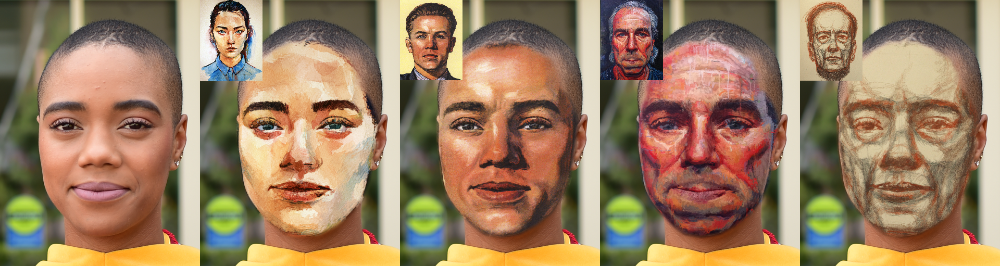

# FaceBlit: Instant Real-Time Example-Based Style Transfer to Facial Videos

The official implementation of

> **FaceBlit: Instant Real-Time Example-Based Style Transfer to Facial Videos** <br>
_[A. Texler](https://www.linkedin.com/in/aneta-texler/), [O. Texler](https://ondrejtexler.github.io/), [M. Kučera](https://www.linkedin.com/in/kuceram/), [M. Chai](http://www.mlchai.com), and [D. Sýkora](https://dcgi.fel.cvut.cz/home/sykorad/)_ <br>
[:globe_with_meridians: Project Page](https://ondrejtexler.github.io/faceblit/index.html), 
[:page_facing_up: Paper](https://dcgi.fel.cvut.cz/home/sykorad/Texler21-I3D.pdf), 
[:books: BibTeX](https://dcgi.fel.cvut.cz/home/sykorad/Texler21-I3D.bib)

FaceBlit is a system for real-time example-based face video stylization that retains textural details
of the style in a semantically meaningful manner, i.e., strokes used to depict specific features in the style are
present at the appropriate locations in the target image. As compared to previous techniques, our system
preserves the identity of the target subject and runs in real-time without the need for large datasets nor
lengthy training phase. To achieve this, we modify the existing face stylization pipeline of 
[Fišer et al. [2017]](https://dcgi.fel.cvut.cz/home/sykorad/facestyle.html) so that it can quickly generate a set 
of guiding channels that handle identity preservation of the target subject while are still compatible with a faster 
variant of patch-based synthesis algorithm of [Sýkora et al. [2019]](https://dcgi.fel.cvut.cz/home/sykorad/styleblit.html).
Thanks to these improvements we demonstrate a first face stylization pipeline that can instantly transfer
artistic style from a single portrait to the target video at interactive rates even on mobile devices.





## Introduction
:warning: DISCLAIMER: This is a research project, not a production-ready application, it may contain bugs!

This implementation is designed for two platforms - Windows and Android. 

* All C++ sources are located in `FaceBlit/app/src/main/cpp`, except for `main.cpp` and `main_extension.cpp` which can be found in `FaceBlit/VS`
* All Java sources are stored in `FaceBlit/app/src/main/java/texler/faceblit`
* Style exemplars (.png) are located in `FaceBlit/app/src/main/res/drawable`
* Files holding detected landmarks (.txt) and lookup tables (.bytes) for each style are located in `FaceBlit/app/src/main/res/raw`
* The algorithm assumes the style image and input video/image have the same resolution 


## Build and Run
* Clone the repository `git clone https://github.com/AnetaTexler/FaceBlit.git`
* The repository contains all necessary LIB files and includes for both platforms, except for the OpenCV DLL files for Windows
* The project uses Dlib 19.21 which is added as one source file (`FaceBlit/app/src/main/cpp/source.cpp`) and will be compiled with other sources; so you don't have to worry about that

### Windows
* The **OpenCV 4.5.0** is required, you can download the pre-built version directly from [here](https://sourceforge.net/projects/opencvlibrary/files/4.5.0/opencv-4.5.0-vc14_vc15.exe/download) and add `opencv_world450d.dll` and `opencv_world450.dll` files from `opencv-4.5.0-vc14_vc15/build/x64/vc15/bin` into your PATH
* Open the solution `FaceBlit/VS/FaceBlit.sln` in Visual Studio (tested with VS 2019)
* Provide a facial video/image or use existing sample videos and images in `FaceBlit/VS/TESTS`.
  * The input video/image has to be in resolution **768x1024 pixels** (width x height)
* In `main()` function in `FaceBlit/VS/main.cpp`, you can change parameters:
  * `targetPath` - path to input images and videos (there are some sample inputs in `FaceBlit/VS/TESTS`)
  * `targetName` - name of a target PNG image or MP4 video with extension (e.g. "target2.mp4")
  * `styleName` - name of a style with extension from the `FaceBlit/app/src/main/res/drawable` path (e.g. "style_het.png")
  * `stylizeBG` - true/false (true - stylize the whole image/video, does not always deliver pleasing results; false - stylize only face)
  * `NNF_patchsize` - voting patch size (odd number, ideal is 3 or 5); 0 for no voting
* Finally, run the code and see results in `FaceBlit/VS/TESTS` 


### Android
* OpenCV binaries (.so) are already included in the repository (`FaceBlit/app/src/main/jniLibs`)
* Open the FaceBlit project in Android Studio (tested with **Android Studio 4.1.3** and **gradle 6.5**), install **NDK 21.0.6** via `File > Settings > Appearance & Behavior > System Settings > Android SDK > SDK Tools` and build the project.
* Create a new directory called `models` inside the `Download` directory of your mobile storage and copy there the Dlib model `shape_predictor_68_face_landmarks.dat` located in `FaceBlit/VS/facemark_models`
* Install the application on your mobile and face to the camera (works with both front and back). Press the right bottom button to display styles (scroll right to show more) and choose one. Wait a few seconds until the face detector loads, and enjoy the style transfer!


## Adding a new style
If you want to add a new style exemplar and generate its resources, follow these steps:
* Prepare a style exemplar - high-quality portrait image of a human facing front in exact resolution **768x1024 pixels** (width x height)
* In the `main()` function in `FaceBlit/VS/main.cpp`, call function `addNewStyle(inputPath)`, where
  * `inputPath` - a path to the new style exemplar and its name (e.g. `C:\Users\Aneta\Pictures\styles\monalisa.png`)
* For the given style exemplar, the `addNewStyle(...)` function 
  * detects facial landmarks and creates text file with coordinates (e.g. `lm_monalisa.txt`)
    * the file is saved into `FaceBlit/app/src/main/res/raw` 
  * generates lookup table (e.g. `lut_monalisa.bytes`),
    * the file is saved into `FaceBlit/app/src/main/res/raw`  
  * creates all required copies of the style image for both platforms - original resolution for desktop and lower resolution with a thumbnail for Android (e.g. `style_monalisa.png`, `style_monalisa_480x640.png`, `recycler_view_monalisa.jpg`)
    * such images are saved into `FaceBlit/app/src/main/res/drawable`
  * delivers a java code snippet for Android app that has to be copy-pasted into the `FaceBlit/app/src/main/java/texler/faceblit/utils/ResourceHelper.java` inside the switch block. 
    * Java snippet example:
      ```java
      ...
      case "monalisa":
          id_img = R.drawable.style_monalisa_480x640;
          id_lm = R.raw.lm_monalisa_480x640;
          id_lut = R.raw.lut_monalisa_480x640;
          break;
      ...
      ```


## License
The algorithm is not patented. The code is released under the public domain - feel free to use it for research or commercial purposes.

## Citing
If you find _FaceBlit_ useful for your research or work, please use the following BibTeX entry.

    @Article{Texler21-I3D,
        author    = "Aneta Texler and Ond\v{r}ej Texler and Michal Ku\v{c}era and Menglei Chai and Daniel S\'{y}kora",
        title     = "FaceBlit: Instant Real-time Example-based Style Transfer to Facial Videos",
        journal   = "Proceedings of the ACM in Computer Graphics and Interactive Techniques",
        volume    = "4",
        number    = "1",
        year      = "2021",
    }
